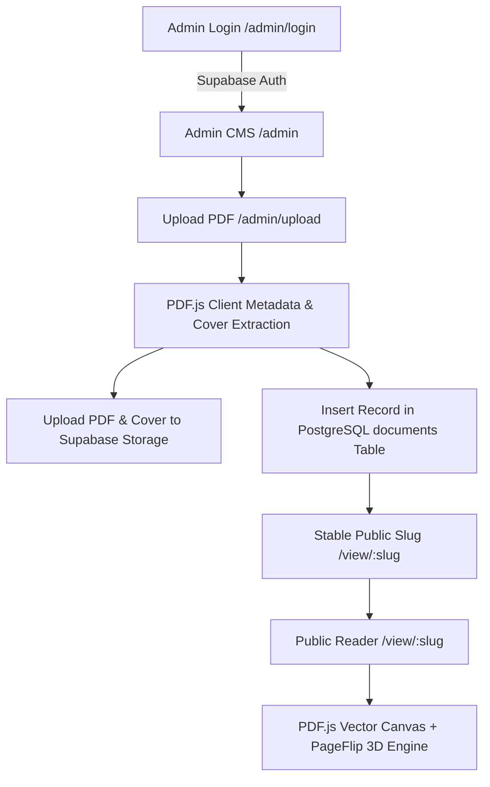

# FolioFlip — Production-Ready PDF Flipbook Publishing Platform

FolioFlip is a clean, modern web application that allows administrators to upload PDF documents and automatically publish each PDF through a unique, publicly shareable URL as an interactive, realistic 3D digital flipbook.

Public visitors can read published flipbooks instantly without requiring an account or login.

---

## Key Features

- **Admin Publishing CMS**:
  - Secure email/password authentication via Supabase Auth.
  - Interactive PDF drag-and-drop uploader.
  - Automatic page count extraction and first-page `.webp` cover thumbnail generation using client-side PDF.js.
  - Metadata management (Title, Description, Author, Category, Status).
  - Stable human-readable public URL slug generation (e.g. `/view/annual-report-2026`).
  - Publish / Unpublish visibility toggle.
  - **Replace PDF**: Replace underlying PDF file while maintaining the exact same public URL slug.
  - Confirmation-guarded document deletion.

- **Immersive Public Flipbook Reader**:
  - Zero login required for readers.
  - Vector PDF rendering via PDF.js with Retina / High-DPI canvas scaling.
  - Realistic 3D page-flipping animation using HTML5 PageFlip engine (paper curling, dual-page desktop spread, single-page mobile layout, corner folds, edge perspective).
  - Floating auto-hiding control toolbar (Prev/Next, Page X / Y, Jump to page input, Zoom 50%-200%, Fullscreen toggle, Thumbnails sidebar drawer, Share modal).
  - Keyboard navigation (Arrow keys, Home, End, Escape).
  - Mobile touch swipe gestures & pinch zoom.
  - Reduced motion fallback support (`prefers-reduced-motion`).
  - Lazy loading & rendering of adjacent pages to preserve memory on large 100+ page PDFs.
  - Session-debounced view tracking counter.

- **Public Library & Landing Page**:
  - Editorial landing page.
  - Public publication catalog (`/documents`) with category filter tabs and search.

---

## Technology Stack

- **Framework**: Next.js 14+ (App Router), React 19, TypeScript
- **Styling**: Tailwind CSS, Lucide Icons, Framer Motion
- **PDF Rendering**: `pdfjs-dist` with bundled local web worker (`public/pdf.worker.min.mjs`)
- **Animation**: `page-flip` (StPageFlip)
- **Backend & Database**: Supabase (PostgreSQL, Supabase Auth, Supabase Storage buckets `pdfs` and `covers`, Row Level Security policies)

---

## Architecture Flowchart



---

## Quick Start & Local Setup

### 1. Install Dependencies

```bash
npm install
```

### 2. Configure Environment Variables

Copy `.env.example` to `.env.local`:

```bash
cp .env.example .env.local
```

Fill in your Supabase project credentials in `.env.local`:

```env
NEXT_PUBLIC_SUPABASE_URL=https://your-supabase-project.supabase.co
NEXT_PUBLIC_SUPABASE_ANON_KEY=your-supabase-anon-key
NEXT_PUBLIC_ADMIN_EMAILS=admin@example.com
```

*Note: If environment variables are unconfigured, the application displays a clear setup instruction banner rather than switching to fake mock data.*

### 3. Initialize Supabase Database & Storage

Copy and execute the SQL script in `supabase/schema.sql` inside your Supabase Dashboard -> **SQL Editor**.

This automatically creates:
- `documents` table with indexes
- `increment_document_views` stored procedure
- Row Level Security (RLS) database policies
- `pdfs` and `covers` storage buckets with access policies

### 4. Create First Admin User

1. In Supabase Dashboard -> **Authentication** -> **Users** -> **Add User**.
2. Enter your admin email (e.g. `admin@example.com`) and password.
3. Start local development server.

### 5. Run Local Server

```bash
npm run dev
```

Open [http://localhost:3000](http://localhost:3000) in your browser.

---

## Documentation

Detailed architectural documentation is available in the `/docs` directory:

- [Architecture Overview](file:///c:/Users/alber/OneDrive/Desktop/alwin-booklet/docs/architecture.md)
- [Database Schema & ERD](file:///c:/Users/alber/OneDrive/Desktop/alwin-booklet/docs/database.md)
- [Authentication & Security](file:///c:/Users/alber/OneDrive/Desktop/alwin-booklet/docs/authentication.md)
- [Storage Architecture](file:///c:/Users/alber/OneDrive/Desktop/alwin-booklet/docs/storage.md)
- [PDF Rendering Engine](file:///c:/Users/alber/OneDrive/Desktop/alwin-booklet/docs/pdf-viewer.md)
- [Production Deployment](file:///c:/Users/alber/OneDrive/Desktop/alwin-booklet/docs/deployment.md)
- [Security Policy](file:///c:/Users/alber/OneDrive/Desktop/alwin-booklet/docs/security.md)

---

## Verification & Build

To test and compile for production:

```bash
# Type check and build
npm run build

# Start production server
npm start
```
