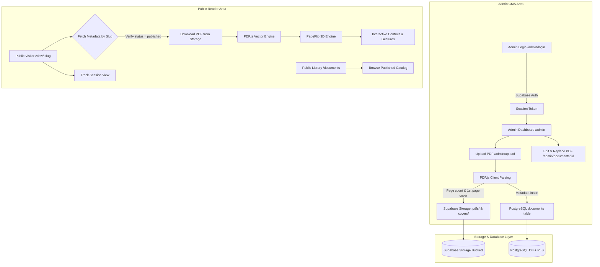

# Technical Architecture & Subsystems

This document describes the high-level architecture, data flows, and subsystem boundaries of the Digital PDF Flipbook Publishing Platform.

---

## 1. System Architecture Diagram

---

## 2. Core Subsystems

### Admin Publishing CMS (`/admin`)
- **Authentication**: Managed via Supabase Auth (`signInWithPassword`, persistent JWT tokens).
- **Authorization**: Server & client guard (`isUserAdmin`) checking email whitelists and RLS role policies.
- **Upload Pipeline**: Client-side parsing using `pdfjs-dist` to extract total page count and generate a first-page `.webp` cover image thumbnail prior to network transmission.
- **Document Management**: CRUD interface allowing metadata updates, publication state toggling (`published` vs `draft`), PDF replacement while keeping stable URL slugs, and safe deletion.

### Public Reader Platform (`/view/[slug]`)
- **Zero Login Requirement**: Public visitors require no account or authentication tokens.
- **Stable URL Routing**: Human-readable unique slugs (e.g., `/view/annual-report-2026`).
- **Vector PDF Rendering**: Client-side PDF page rendering using HTML5 Canvas scaled to `window.devicePixelRatio` for retina clarity.
- **3D PageFlip Engine**: Realistic page curling animations, dual-page desktop spread, single-page mobile layout, corner fold shadows, and reduced motion fallbacks.
- **Session View Tracking**: Session-debounced counter invoking PostgreSQL stored procedures (`increment_document_views`).
