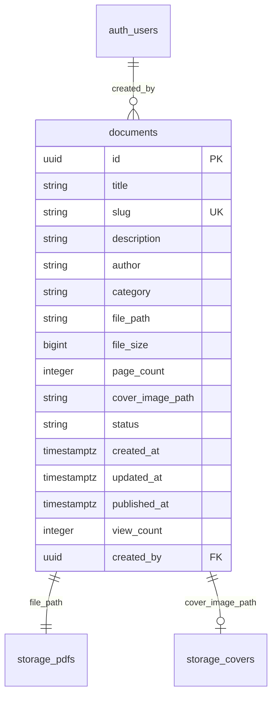

# Database Schema & Entity Relationships

The platform uses PostgreSQL hosted on Supabase as its primary metadata store.

---

## Entity Relationship Model



---

## Database Table Definition

### `public.documents`

| Column | Type | Constraints | Description |
| :--- | :--- | :--- | :--- |
| `id` | `UUID` | Primary Key, DEFAULT `uuid_generate_v4()` | Unique document identifier |
| `title` | `TEXT` | NOT NULL | Title of publication |
| `slug` | `TEXT` | UNIQUE, NOT NULL, INDEXED | Human-readable public URL slug |
| `description` | `TEXT` | NULLABLE | Detailed description |
| `author` | `TEXT` | NULLABLE | Author or publishing organization |
| `category` | `TEXT` | NULLABLE, INDEXED | Category classification |
| `file_path` | `TEXT` | NOT NULL | Storage path in `pdfs` bucket |
| `file_size` | `BIGINT` | NOT NULL, DEFAULT 0 | File size in bytes |
| `page_count` | `INTEGER` | NOT NULL, DEFAULT 0 | Total page count |
| `cover_image_path` | `TEXT` | NULLABLE | Storage path in `covers` bucket |
| `status` | `TEXT` | NOT NULL, CHECK (`draft`, `published`, `archived`) | Visibility status |
| `created_at` | `TIMESTAMPTZ` | NOT NULL, DEFAULT `now()` | Record creation timestamp |
| `updated_at` | `TIMESTAMPTZ` | NOT NULL, DEFAULT `now()` | Last modification timestamp |
| `published_at` | `TIMESTAMPTZ` | NULLABLE | Publication timestamp |
| `view_count` | `INTEGER` | NOT NULL, DEFAULT 0 | Total unique view count |
| `created_by` | `UUID` | Foreign Key `auth.users(id)` | Admin user ID who created document |

---

## Stored Procedures

### `increment_document_views(doc_slug TEXT)`
Atomic function that safely increments the document view count for published documents without race conditions:

```sql
CREATE OR REPLACE FUNCTION public.increment_document_views(doc_slug TEXT)
RETURNS VOID
LANGUAGE plpgsql
SECURITY DEFINER
AS $$
BEGIN
    UPDATE public.documents
    SET view_count = view_count + 1
    WHERE slug = doc_slug AND status = 'published';
END;
$$;
```
